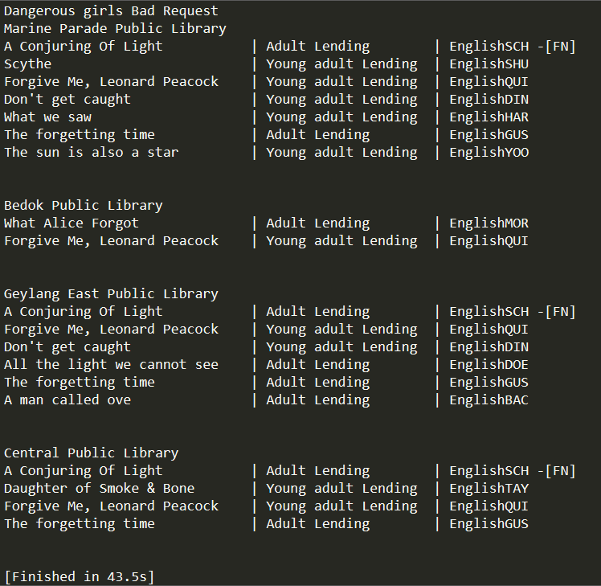

# bookbuddy

A simple python script to query for the availability of books on my to-read list on GoodReads in NLB Catalogue (Singapore).
To implement with API for both but not yet lol.

### 15 Jun Update
- `script2.py` done using `BeautifulSoup`
- `script3.py` done parsing toread list from Goodreads. Key to be hidden. Waiting for NLB API


### Tasks
- [x] Book as Object
- [x] Populate booklist.txt
- [x] display lib with top books
- [ ] ranked in order of preference of library
- [ ] export results as text to tele/whatsapp??
- [x] Goodreads 
- [ ] NLB Catalogue API

### Setup
Install lxml library which is an extensive library for parsing xml and html documents quickly. 
Install requests module due to improvements in speed and reliability
```
pip install lxml
pip install requests
```
### 23/4/2017


### 4/8/2018
To activate venv: `venv\Scripts\activate`
To deactivate: `deactivate`